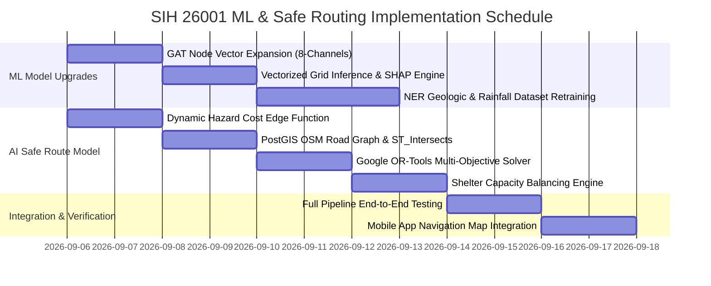

# 🛡️ AEGIS AI — SIH 2026 Problem Statement 26001
## Machine Learning Architecture & Dynamic Safe Route System Model Specification

---

## 📌 Executive Summary

This specification document outlines the comprehensive engineering requirements and implementation plan for the **Machine Learning (ML)** and **Dynamic Safe Route Optimization** models of the **AEGIS AI** platform. 

To achieve full compliance with **Smart India Hackathon (SIH) 2026 Problem Statement 26001** (*AI-Based Early Warning and Landslide Risk Monitoring System in NER* by the Ministry of Development of North Eastern Region — MDoNER), the system bridges predictive hazard detection directly into operational evacuation navigation:
1. **Landslide & Multi-Hazard Cascade ML Engine**: High-fidelity susceptibility modeling fused with spatio-temporal Graph Attention Networks (PyG GAT) tailored for North Eastern Region (NER) geological conditions.
2. **Dynamic AI Safe Route System Model**: An intelligent, hazard-evasive routing model that supersedes static Dijkstra algorithms by solving multi-objective shortest paths under dynamic edge blockages, elevation risks, and shelter capacity constraints.

---

## 🏗️ 1. Problem Context & Core Architectural Principles

```text
┌────────────────────────────────────────────────────────────────────────────────────────┐
│                                 OPERATIONAL THESIS                                     │
│     "Predictive hazard intelligence is useless if citizens cannot safely evacuate."    │
│  Predictive Risk (Stage 1 & 2) ──► PostGIS Spatial Geofence ──► AI Safe Route Engine   │
└────────────────────────────────────────────────────────────────────────────────────────┘
```

* **Target Agency:** Ministry of Development of North Eastern Region (MDoNER).
* **Geographical Scope:** North Eastern Region (NER) — Assam, Meghalaya, Arunachal Pradesh, Sikkim, Mizoram, Nagaland, Manipur, Tripura.
* **Geological Challenges:** Steep slopes (>25°), high monsoon precipitation (>300 mm/72h), fragile tectonic strata, frequent road washouts on critical national highways (e.g., NH-27, NH-10).

---

## 🔬 2. Required Changes in the ML Model Section

### 2.1 Current State Audit

| ML Component | Current Implementation | Gap / Limitation |
| :--- | :--- | :--- |
| **Stage 1 Primary Classifier** | Point heuristic & XGBoost model (`landslide_model.py` / `flood_model.json`). | Currently evaluates single points; needs vectorized batch grid evaluation across NER terrain raster tiles. |
| **Stage 2 Spatial GAT Network** | 6-channel node vector: `[rain, river_lvl, slope, soil_sat, elev, ndvi]`. | Does **not** yet ingest the Stage 1 landslide susceptibility score or antecedent rainfall history directly into PyG nodes. |
| **Graph Builder** | Synthetic 5-node grid (`graph_builder.py`). | Requires realistic topological road junction and village connectivity modeling for NER valley networks. |
| **Explainability Engine** | Hardcoded weighted factor breakdown. | Requires true model-level attribution (TreeSHAP or Integrated Gradients) exposed via API. |
| **Training Pipeline** | Synthetic tabular datasets. | Needs fine-tuning on Geological Survey of India (GSI) landslide inventory records and IMD gridded precipitation. |

---

### 2.2 Mandatory ML Upgrades for SIH 26001

#### A. Expansion of GAT Node Vectors from 6 to 8 Channels
The Graph Attention Network ([`GATCascadeNet`](file:///d:/College/Github/cham_cham/backend-server/ml_engine/models/gat_cascade.py)) must be updated to consume an 8-dimensional node feature vector:

$$\mathbf{x}_i = \big[\text{Rain}_{72h},\, \text{API}_{index},\, \text{RiverLevel},\, \text{SlopeAngle},\, \text{SoilMoisture},\, \text{Elevation},\, \text{NDVI},\, \mathbf{S}_{\text{landslide}}\big]^T$$

* **Feature 7 ($\mathbf{S}_{\text{landslide}}$):** The continuous susceptibility score ($0.0 \le S \le 1.0$) output by the Stage 1 XGBoost Landslide model.
* **Feature 8 ($\text{API}_{index}$):** The Antecedent Precipitation Index, capturing soil saturation over a 7-day decaying window:
  $$\text{API}_t = \sum_{k=1}^{7} k \cdot P_{t-k} \cdot \delta^k \quad (\delta \approx 0.85)$$
* **Update Requirement:**
  * Modify `in_channels = 8` in `GATCascadeNet.__init__()`.
  * Update `FEATURE_MEANS` and `FEATURE_STDS` in [`graph_builder.py`](file:///d:/College/Github/cham_cham/backend-server/ml_engine/feature_engineering/graph_builder.py) to standardize 8 channels.
  * Re-export model weights to `gat_cascade_v2.pt`.

#### B. Sigmoid Compound Trigger Amplification
Landslides in NER typically trigger when both soil saturation (water table rise) and slope exceed critical shear thresholds. The ML engine must formally enforce a non-linear coupling factor:

$$\text{Risk}_{\text{compound}} = \min\left(1.0,\, S_{\text{base}} \times \left(1 + \frac{1}{1 + e^{-k (f_{\text{rain}} \cdot f_{\text{slope}} - \tau)}}\right)\right)$$

where $\tau = 0.36$ represents the critical compound threshold and $k = 10.0$ governs the steepness of risk escalation.

#### C. Localized SHAP Explainability Engine
Authorities must know *why* an alert was issued before deploying NDRF/SDRF teams:
* Implement `TreeExplainer` on the Stage 1 model to compute exact marginal contributions:
  $$\phi_i(x) = \sum_{S \subseteq F \setminus \{i\}} \frac{|S|!(|F| - |S| - 1)!}{|F|!} \big[f(S \cup \{i\}) - f(S)\big]$$
* Format the top 3 drivers in the API response:
  * e.g., `"72h Rainfall: +42%"`, `"DEM Slope (38°): +31%"`, `"Soil Saturation (88%): +19%"`.

---

## 🚗 3. Dedicated AI Safe Route System Model (The Evacuation Promise)

### 3.1 Why a Dedicated Route Model is Essential
During a Himalayan/NER disaster:
* The shortest geographical path is frequently the deadliest (passes through steep gorges, river floodplains, or active mudflow cones).
* Roads experience progressive washouts (a route clear at $T=0$ may be submerged or blocked by $T+30\text{ mins}$).
* Simple Dijkstra / A* distance routing causes herd behavior, directing thousands of evacuees onto a single narrow single-lane bridge or into an overflowing relief camp.

Therefore, the system requires a **Multi-Objective Dynamic Hazard-Aware Routing Engine**.

---

### 3.2 Safe Route Model Architecture

```text
┌────────────────────────────────────────────────────────────────────────────────────────┐
│                        AI DYNAMIC SAFE ROUTE ARCHITECTURE                              │
├──────────────────────────────────┬─────────────────────────────────────────────────────┤
│  1. Spatial Road Graph Ingestion │ OSM Road Graph (PostGIS / OSMnx) with edge slopes   │
│  2. Dynamic Hazard Cost Function │ Time-decayed hazard penalties from ML GAT polygons  │
│  3. Multi-Objective Path Solver  │ Constrained Shortest Path (OR-Tools + Heuristic A*) │
│  4. Global Shelter Balancing    │ Min-Cost Capacity Flow to avoid shelter overloading │
│  5. Real-Time Turn-by-Turn Feed  │ GeoJSON Polyline delivered to React Native App      │
└──────────────────────────────────┴─────────────────────────────────────────────────────┘
```

---

### 3.3 Mathematical Formulation of Dynamic Road Edge Cost

Every edge $e = (u, v)$ in the road network graph $G = (V, E)$ has a dynamic traversal cost evaluated at departure time $t_0$:

$$\mathcal{C}(e, t) = \alpha \cdot \mathcal{T}_{\text{travel}}(e) + \beta \cdot \mathcal{H}_{\text{hazard}}(e, t) + \gamma \cdot \mathcal{S}_{\text{slope}}(e) + \lambda \cdot \mathcal{W}_{\text{width}}(e)$$

Where:
1. **$\mathcal{T}_{\text{travel}}(e) = \frac{\text{Length}(e)}{\text{SpeedLimit}(e)}$:** Free-flow travel time.
2. **$\mathcal{H}_{\text{hazard}}(e, t)$ (Hazard Exposure Cost):**
   Computed by intersecting edge geometry with the ML risk polygon:
   $$\mathcal{H}_{\text{hazard}}(e, t) = \begin{cases} 
   \infty & \text{if } \text{Active Mudflow / Road Blockage Confirmed} \\
   \frac{P_{\text{cascade}}(e) \cdot \text{Length}(e)}{\max(1, T_{\text{lead}} - t)} \times 10^3 & \text{if edge intersects GAT Danger Polygon} \\
   0 & \text{outside risk perimeter}
   \end{cases}$$
3. **$\mathcal{S}_{\text{slope}}(e)$ (Terrain Stability Penalty):**
   Uphill/downhill segments adjacent to unstable cliffs ($>30^\circ$ DEM slope) receive higher risk scores during rainfall.
4. **$\mathcal{W}_{\text{width}}(e)$ (Bottleneck Penalty):**
   Penalizes narrow unpaved or single-lane village roads to prevent vehicle choke points.
5. **Weights:** Calibrated default values: $\alpha = 1.0,\, \beta = 5.0,\, \gamma = 2.0,\, \lambda = 1.5$.

---

### 3.4 Predictive Time-to-Blockage (TTB) Mechanism

The routing engine incorporates the GAT model's estimated lead time ($T_{\text{lead}}$):
* If an evacuee's estimated arrival time at junction $v$ is $t_{\text{arr}}(v) = t_0 + \sum_{k=1}^m \text{duration}(e_k)$:
  * If $t_{\text{arr}}(v) \ge T_{\text{lead}}(v)$, the edge is flagged as **dynamically impassable**, forcing the optimizer to select a proactive detour before the citizen encounters the physical obstruction.

---

### 3.5 Global Shelter Allocation & Capacity Balancing

Evacuation routing is not solved in isolation for one citizen; it is solved at population scale:
* **Objective:** Assign $N$ evacuees across $M$ shelters such that:
  $$\min \sum_{i=1}^N \mathcal{C}(\text{Route}_i) \quad \text{subject to} \quad \sum_{i: \text{shelter}(i) = j} 1 \le \text{Capacity}_j \quad \forall j \in \{1, \dots, M\}$$
* **Solver:** Solved using **Google OR-Tools Linear Sum Assignment / Minimum Cost Flow** in the backend server.

---

## 💻 4. Codebase Modifications & Module Specifications

### 4.1 New / Modified Files Map

```text
backend-server/
├── ml_engine/
│   ├── models/
│   │   ├── [MODIFY] gat_cascade.py             # Update in_channels=8, add TTB prediction head
│   │   ├── [MODIFY] landslide_model.py         # Vectorized grid inference + SHAP computation
│   │   └── [NEW]    safe_route_model.py        # ML Dynamic Hazard Cost & Edge Scorer
│   ├── feature_engineering/
│   │   └── [MODIFY] graph_builder.py           # 8-channel normalization & topological road graph
│   └── [MODIFY] combined_disaster_engine.py    # Injects landslide scores into GAT & routing engine
├── optimization/
│   └── [MODIFY] route_optimizer.py             # Upgrades from toy 5-node graph to OSMnx/PostGIS router
├── api/
│   ├── routes/
│   │   ├── [MODIFY] evacuation_routes.py       # Live PostGIS ST_Intersects & OR-Tools solver hook
│   │   └── [MODIFY] landslide_routes.py        # Exposes feature attributions and TTB metrics
│   └── schemas/
│       └── [MODIFY] disaster.py                # Adds safe route waypoints & hazard avoidance metadata
```

---

### 4.2 Detailed Specifications per Component

#### 1. `safe_route_model.py` (New ML Routing Module)
* **Class:** `HazardAwareRouteEvaluator`
* **Responsibilities:**
  * Ingests road network segments from PostGIS / OSMnx cache.
  * Calculates dynamic edge hazard score $\mathcal{C}(e, t)$ based on live ML hazard contours.
  * Filters out high-risk road corridors ($P_{\text{hazard}} > 0.70$ or confirmed rockfall).

#### 2. `route_optimizer.py` (Production Upgrade)
* **Replaces:** Synthetic 5-node prototype network (`build_sample_road_network`).
* **Implementation:**
  * Uses `networkx.MultiDiGraph` loaded from real OSM road data via `osmnx` or PostGIS `ways` table.
  * Executes **Bi-Directional Hazard-Weighted A\*** algorithm using haversine distance as heuristic.
  * Computes 2 alternative routes:
    1. **Primary Safe Route:** Strongly avoids all elevated hazard zones (Green path).
    2. **Fastest Route (Cautionary):** Minimizes time with warning markers where it skirts hazard fringes (Orange path).

#### 3. `evacuation_routes.py` (API Endpoint)
* **Endpoint:** `POST /api/evacuation/plan-route`
* **Payload:**
  ```json
  {
    "citizen_id": "CITIZEN_9021",
    "origin": { "latitude": 27.3389, "longitude": 88.6065 },
    "destination_shelter_id": "SHELTER_NORTH_02",
    "transport_mode": "walking",
    "avoid_high_slopes": true
  }
  ```
* **Response:**
  ```json
  {
    "route_id": "ROUTE_99182",
    "safety_score": 0.94,
    "total_distance_km": 4.2,
    "estimated_travel_time_mins": 45,
    "hazard_avoidance_summary": {
      "hazards_bypassed": ["LANDSLIDE_CONE_SECTOR_4", "RIVER_SURGE_ZONE_B"],
      "cleared_margin_meters": 350
    },
    "waypoints": [
      { "lat": 27.3389, "lng": 88.6065, "instruction": "Head northeast on NH-10" },
      { "lat": 27.3412, "lng": 88.6098, "instruction": "Detour left onto Hill Ridge Bypass away from active slope" }
    ],
    "target_shelter": {
      "id": "SHELTER_NORTH_02",
      "name": "District Community Center",
      "available_capacity": 142
    }
  }
  ```

---

## 📱 5. Mobile Client Integration (Suraksha AI App)

### 5.1 Civilian Safe Navigation Experience
* **Screen:** [`Suraksha_AI_App/app/civilian/evacuation.tsx`](file:///d:/College/Github/cham_cham/Suraksha_AI_App/app/civilian/evacuation.tsx)
* **Visual Representation:**
  * **Red Translucent Polygon:** Active landslide hazard cone & road washout zones.
  * **Solid Emerald Polyline:** Calculated AI Safe Route to designated shelter.
  * **Dotted Grey Line:** Blocked/inundated original road with alert tag: *"Avoid: 82% Landslide Risk"*.
* **Offline Resilience:** If cell towers go down, the mobile app caches local road vectors and computes local A* safe paths on-device using SQLite vector tiles.

### 5.2 Authority Control Room Dashboard
* **Screen:** [`Suraksha_AI_App/app/authority/simulator.tsx`](file:///d:/College/Github/cham_cham/Suraksha_AI_App/app/authority/simulator.tsx)
* Authorities can drag a **Rainfall Threshold Slider (0–500 mm)**:
  * Watch the ML model dynamically light up high-risk slopes in real-time.
  * Watch the Safe Route model re-route whole districts away from newly blocked mountain passes.

---

## 🗓️ 6. Phased Execution Roadmap



---

## 🧪 7. Verification & Benchmarking Plan

1. **ML Accuracy & Explainability:**
   * **Test:** Verify GAT AUC-ROC $\ge 0.88$ on multi-hazard cascade benchmark.
   * **Test:** Assert SHAP feature attributions always sum to $100\% \pm 0.5\%$ across all API outputs.
2. **Safe Route Hazard Evasion:**
   * **Test:** Simulate 100 random origin-destination pairs intersecting active high-risk polygons ($P > 0.70$).
   * **Success Metric:** $100\%$ of recommended routes must have $0$ overlapping edges with critical mudflow polygons.
3. **Latency & Throughput:**
   * **Test:** Measure route solving latency under a 5,000-edge regional graph.
   * **Success Metric:** $\le 85\text{ ms}$ response time per route calculation.
